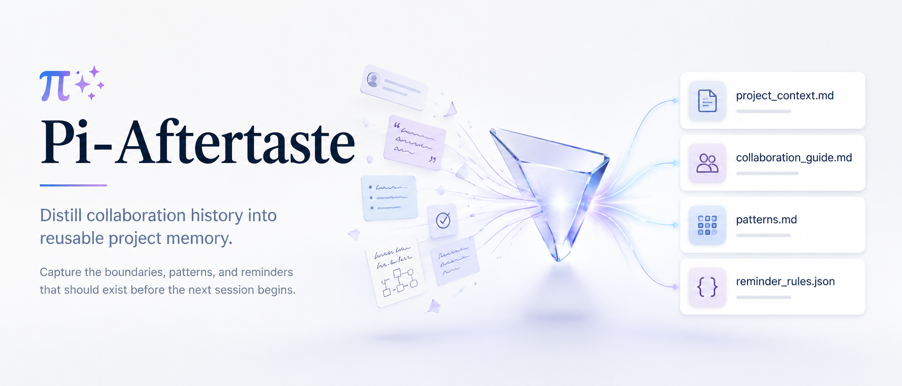

# Pi-Aftertaste



> ***“Those who cannot remember the past are condemned to repeat it.”***
> —— George Santayana
> 
> *“不能记住过去的人，注定会重蹈覆辙。”*

---

把项目里的 Pi 历史协作，沉淀为**可复用的项目上下文、协作规则与运行时提醒**。

它关心的并非“如何保存聊天记录”，而是更值得留下来的那一部分：

- 哪些边界总是在后面才被补充
- 哪些返工点会一再出现
- 哪些协作方式其实早就可以被提前说明
- 哪些判断，值得在下一次开始之前就先回来

Pi-Aftertaste 想做的，是把这些原本会散在 session 里的经验，整理成下一次协作真正能用的一层基础设施。

---

## 1. 它大概是怎么帮你的

一个典型场景是这样的：

### 在使用 Pi-Aftertaste 之前

你经常会遇到这些情况：

- 你本来只想“先看方案，别直接改”，但 agent 还是先动手了
- 你本来只想先修一个点，结果 agent 顺手把范围扩大了，连相关文件、旁支改动、额外清理也一起做了
- 你只是想先本地修好，agent 却默认把 `commit / push / publish` 当成一套动作

这些都不是大 bug，但它们会不断造成：

- 返工
- 多余确认
- 任务边界漂移
- 同样的话一遍一遍重说

### 开始使用 Pi-Aftertaste 之后

它会把历史协作里的稳定信号提炼出来，形成几类产物：

- `project_context.md`：这个项目到底是什么、边界是什么、哪些文件和约束最重要
- `collaboration_guide.md`：在这个项目里，用户和 agent 怎么配合更顺
- `patterns.md`：哪些做法值得以后别的项目复用
- `reminder_rules.json`：运行时可执行的提醒规则（当前是 sidecar MVP）

于是下一次协作时，效果会更像这样：

- agent 更容易先问清边界，再开始做
- 项目上下文不需要每次从零重讲
- 用户输入某些高风险请求时，会先收到一个低打扰提醒
- 一些原本总在后面才补充的约束，会被提前拉到前面

也就是说，它不是单纯总结历史，
而是尽量让历史变成：

> **下一次协作更快、更稳、更少返工的起点。**

---

## 2. 当前包含什么

目前仓库里主要有两条线：

### A. Project Distill Pipeline

把真实项目历史 session 变成三份最终文档：

- `project_context.md`
- `collaboration_guide.md`
- `patterns.md`

当前主流程大致是：

```text
Pi-Aftertaste
│
├─ A. Project Distill Pipeline
│
│   Pi sessions / compiled history
│   │
│   ├─> session collection / compiled inputs
│   │
│   ├─> deterministic chunker
│   │    ├─ 按时间顺序整理 session
│   │    ├─ 合并短 session
│   │    └─ 拆分长 session
│   │
│   ├─> chunk_001.md / chunk_002.md / ...
│   │
│   ├─> chunk analysis
│   │    └─ 生成 chunk_XXX.report.md
│   │
│   ├─> synthesis packet / bundle synthesis
│   │
│   ├─> same-session self-validation
│   │    ├─ 通过：直接落结果
│   │    └─ 不通过：同会话 rewrite
│   │
│   └─> final outputs
│        ├─ project_context.md
│        ├─ collaboration_guide.md
│        └─ patterns.md
│
└─ B. Reminder Rules Sidecar MVP
    │
    ├─> collaboration_guide.md
    │
    ├─> reminder-rules prompt
    │
    ├─> reminder_rules.json
    │
    ├─> project-local Pi extension
    │
    └─> runtime behavior
         ├─ notify   -> 轻提醒，不阻断
         └─ confirm  -> 发送前确认
              ├─ 直接发送，不修改
              ├─ 取消发送，继续修改输入
              └─ 直接发送，并永久忽略此提醒
```

> **说明**  
> 这里的 `compiled history` 当前主要来自另一个独立项目（Pi-VCC compiler），而不是由 Pi-Aftertaste 在本仓库内部完全生成。换句话说，Pi-Aftertaste 目前主要消费“编译后的历史输入”，再在其上做 chunk、synthesis 和 reminder 提炼。  
> 这条上游编译链本身也仍在快速迭代中，因此当前一些输入约定和细节后续仍会继续收口。

### B. Reminder Rules Sidecar MVP

从 `collaboration_guide.md` 单独提炼出：

- `reminder_rules.json`

再由一个 Pi extension 在用户发送请求后、agent 开始前做：

- `notify`：轻提醒，不阻断
- `confirm`：少量高风险场景才确认

当前已经有：

- sidecar 生成脚本
- 规则 schema
- project-local extension MVP
- 可直接测试的 lab 目录

---

## 3. 安装方法

> 当前仓库已经包含一条可实际运行的 **project distill 主线**，可以把项目历史 session 蒸馏成最终文档；同时也保留了一些仍在快速迭代的实验能力，例如 **reminder rules sidecar** 和 **lab**。
>
> 因此最推荐的进入方式有两种：
>
> - 想先快速感受效果：直接跑 `reminder-rules-lab`
> - 想跑完整项目蒸馏：直接使用 `project_distill.py`

### 3.1 环境要求

建议环境：

- Python 3
- Node.js
- 已安装 Pi CLI
- Linux / WSL 优先

### 3.2 获取仓库

```bash
git clone <your-repo-url>
cd pi-distill
```

### 3.3 最快体验：直接进 lab 目录

```bash
cd reminder-rules-lab
pi
```

如果 Pi 首次询问信任项目，选择信任即可。这样 project-local extension 才会加载。

进入后建议先试：

```text
/reminder-rules-status
/reminder-rules-check 改完直接 commit push，然后 npm publish
```

再复制 `TEST_CASES.md` 里的句子做真实测试。

### 3.4 跑完整 distill 主线

如果你想直接跑完整的项目蒸馏流程，而不是只体验 reminder lab，可以使用：

```bash
python3 project_distill.py \
  --mode experiment \
  --experiment-name my-distill-run \
  --compiled-root /path/to/compiled \
  --project-root /path/to/project \
  --runner pi-cli-json \
  --model openai-codex/gpt-5.4-mini \
  --thinking medium
```

它会产出完整的三份最终文档：

- `project_context.md`
- `collaboration_guide.md`
- `patterns.md`

> 备注：当前主线已经可运行，但整体项目仍在快速收口中。尤其是 prompt 组织、groundedness、reminder rules 并入主 pipeline、以及运行时交互细节，后续还会继续打磨...此仓库为 public repo，后续会逐渐完善丰富

---

## 4. 安装后会对你的 Pi / 项目产生什么影响

这个部分很重要。当前默认设计是：**尽量 project-local，尽量可见，尽量不偷偷改全局行为。**

### 4.1 直接跑 `reminder-rules-lab` 时

影响范围主要在这个实验目录里：

```text
reminder-rules-lab/
  .pi/extensions/reminder-rules/
  .pi-distill/final/reminder_rules.json
```

含义：

- `.pi/extensions/...`：这是当前项目目录下的 Pi extension 挂载点
- `.pi-distill/final/reminder_rules.json`：当前项目测试用的提醒规则文件

这意味着：

- 这个 lab 的提醒行为是**项目级**的，不是全局改你的 Pi
- 退出这个目录后，不会自动影响别的项目

### 4.2 使用 reminder rules 的“永久忽略”时

如果你在确认框里选：

- `直接发送，并永久忽略此提醒`

当前项目下会新增：

```text
.pi-distill/reminder_rules_ignored.json
```

它只记录：

- 当前项目里哪些规则被你永久忽略了

不会影响别的项目。

### 4.3 跑 sidecar 生成器时

默认会在仓库里写实验产物，例如：

```text
.scratch/reminder-rules/runs/<run-id>/
```

里面会保存：

- 输入 guide 副本
- prompt 副本
- 生成的 `reminder_rules.json`
- manifest

### 4.4 跑 project distill experiment 时

默认会在仓库里写：

```text
experiments/<experiment-name>/
```

包括：

- `runtime/`
- `final/`
- `manifest.json`
- chunk reports
- synthesis artifacts
- validation artifacts

### 4.5 跑真实项目级模式时

运行时可能会写到：

```text
~/.pi-distill/projects/<project-id>/...
```

或未来写到：

```text
<project-root>/.pi-distill/
```

总之，当前原则是：

> **生成的状态、缓存、规则、产物都尽量落在可见目录里，而不是偷偷塞进不透明位置。**

---

## 5. 使用方法

## 5.1 直接体验 reminder rules

进入实验目录：

```bash
cd reminder-rules-lab
pi
```

建议测试顺序：

### 看规则是否加载成功

```text
/reminder-rules-status
```

### 预判一条输入会命中什么

```text
/reminder-rules-check 改完直接 commit push，然后 npm publish
```

### 做真实输入测试

复制 `TEST_CASES.md` 里的句子。

当前提醒行为：

- `notify`：只提醒，不阻断
- `confirm`：弹三个明确选项
  - `直接发送，不修改`
  - `取消发送，继续修改输入`
  - `直接发送，并永久忽略此提醒`

如果你选“取消发送，继续修改输入”：

- 原输入会放回编辑框
- 不会直接丢掉

如果你选“直接发送，并永久忽略此提醒”：

- 当前项目以后不再弹这条提醒
- 可用下面命令恢复：

```text
/reminder-rules-reset-ignored
```

---

## 5.2 从 `collaboration_guide.md` 生成 reminder rules

### fake runner（最快）

```bash
python3 reminder_rules_sidecar.py \
  --guide .scratch/reminder-rules/sample_input.collaboration_guide.md \
  --runner fake
```

### 真实 Pi runner

```bash
python3 reminder_rules_sidecar.py \
  --guide /path/to/collaboration_guide.md \
  --runner pi-cli-json \
  --model openai-codex/gpt-5.4-mini \
  --thinking medium
```

输出是：

- `reminder_rules.json`

---

## 5.3 跑 project distill pipeline

这是主线能力，用来从项目历史里生成三份最终文档。

典型 experiment 命令形态：

```bash
python3 project_distill.py \
  --mode experiment \
  --experiment-name sandbox-project-distill-real-synthesis \
  --compiled-root pi-distill/vcc-base/sandbox-for-pi/compiled \
  --project-root /absolute/path/to/project \
  --runner pi-cli-json \
  --model openai-codex/gpt-5.4-mini \
  --thinking medium \
  --prompt-version real-synthesis-v1
```

当前主线已经支持：

- chunk analysis
- bundle synthesis
- same-session self-validation
- rewrite retry

---

## 6. 你会得到什么产物

### Distill 最终文档

- `project_context.md`
- `collaboration_guide.md`
- `patterns.md`

### Reminder sidecar 产物

- `reminder_rules.json`

### 运行时辅助文件

- `reminder_rules_ignored.json`（当前项目级永久忽略列表）

### 中间过程产物

视运行路径不同，还会有：

- chunk reports
- synthesis bundle
- self-validation JSON
- critique
- manifests
- runtime prompts

---

## 7. 当前目录结构（只列关键部分）

```text
pi-distill/
  README.md
  project_distill_pipeline.py
  reminder_rules_sidecar.py
  reminder_rules_extension.ts
  reminder_rules_runtime.mjs
  docs/
    prompts/
  .scratch/
    project-distill-pipeline/
    reminder-rules/
  experiments/
  reminder-rules-lab/
  test_project_distill.py
  test_reminder_rules_sidecar.py
  test_reminder_rules_runtime.mjs
```

---

## 8. 当前状态

### 已完成

- project distill pipeline MVP
- real Pi runner
- bundle-first synthesis
- same-session self-validation
- reminder rules sidecar generator
- reminder rules extension MVP
- reminder-rules-lab 可直接手测

### 正在收口

- prompt source-of-truth 统一到 `docs/prompts/`
- reminder rules 是否并入主 synthesis bundle
- reminder rules validator 与误报控制
- 最终对外 README / 文档化整理

---

## 9. 适合谁

如果你符合下面任意一种情况，这个仓库就值得你看：

- 你长期用 Pi 做一个项目，历史 session 很多
- 你不想每次开新 session 都重新解释一遍项目边界
- 你已经发现某些返工点会反复出现
- 你希望把“怎么协作更顺”沉淀成项目资产，而不是只留在脑子里

---

## 10. 一句话收尾

> ***“Experience is not what happens to you; it is what you do with what happens to you.”***
> —— Aldous Huxley  
> 
> *“经验不是发生在你身上的事，而是你如何处理发生在你身上的事。”*

Pi-Aftertaste 的目标不是把历史对话存下来，
而是把历史协作里的有效部分提炼出来，变成：

> **未来 agent 更快接手、用户更少返工、项目上下文更可复用的一层基础设施。**
